<!-- ═══════════════════════════════════════════════════════════════ -->
<!--                         HEADER  /  BANNER                        -->
<!-- ═══════════════════════════════════════════════════════════════ -->

 

  <em>2+ years building production multi-agent &amp; AI systems — the behind-the-scenes machinery that helps teams move faster.</em>

  
  
  
  

<!-- ── quick nav ── -->

  <a href="#-impact-ive-shipped">⚡ Impact</a> &nbsp;•&nbsp;
  <a href="#-what-i-love-working-on">🚀 About</a> &nbsp;•&nbsp;
  <a href="#-tech-i-use-daily">🧰 Stack</a> &nbsp;•&nbsp;
  <a href="#-github-stats">📊 Stats</a> &nbsp;•&nbsp;
  <a href="#-highlighted-work--atlan">💡 Work</a> &nbsp;•&nbsp;
  <a href="#-lets-build-something">📫 Connect</a>

<!-- ═══════════════════════════════════════════════════════════════ -->
<!--                         IMPACT  METRICS                          -->
<!-- ═══════════════════════════════════════════════════════════════ -->

### ⚡ Impact I've Shipped

<table>
  <tr>
    <td align="center" width="25%">
      <h2>$60K–100K</h2>
      <b>Annual savings</b> support automation deflecting 18→75 tickets/mo
    </td>
    <td align="center" width="25%">
      <h2>700K+</h2>
      <b>Assets documented</b> 50 customers in 14 days · 90%+ acceptance
    </td>
    <td align="center" width="25%">
      <h2>450×</h2>
      <b>Faster</b> than manual documentation workflows
    </td>
    <td align="center" width="25%">
      <h2>75%</h2>
      <b>Correctness</b> ticket-to-PR agent, up from 40%
    </td>
  </tr>
</table>

---

### 🚀 What I Love Working On

- 🤖 **Multi-agent systems** that reason, plan, and act — not just autocomplete
- 🧩 **Agentic RAG & tool-use** pipelines wired into real production workflows
- 📉 **AI that reduces toil** — turning tickets, docs, and glossaries into automated flows
- 🛠️ **Reliable agents** — evals, guardrails, and observability so it works at scale

> AI isn't just about automating random tasks — it's about making people **faster** and building tools companies feel from the inside out.

---

### 🧰 Tech I Use Daily

**🧠 AI / Agents**
 

**⚙️ Backend & Infra**
 

**🎨 Frontend**
 

**🔭 Observability**
 

---

<!-- ═══════════════════════════════════════════════════════════════ -->
<!--                         GITHUB  STATS                            -->
<!-- ═══════════════════════════════════════════════════════════════ -->

### 📊 GitHub Stats

<!-- Auto-generated in-repo by .github/workflows/metrics.yml (lowlighter/metrics) — renders off GitHub's CDN, never rate-limited -->

 

<!-- Full-year commit heatmap (isocalendar) -->

 

<!-- Contribution activity over time -->

<!-- ── snake contribution animation (self-hosted on the output branch) ── -->
<picture>
  <source media="(prefers-color-scheme: dark)" srcset="https://raw.githubusercontent.com/aravindsriraj/aravindsriraj/output/github-snake-dark.svg" />
  <source media="(prefers-color-scheme: light)" srcset="https://raw.githubusercontent.com/aravindsriraj/aravindsriraj/output/github-snake.svg" />
  
</picture>

---

### 💡 Highlighted Work @ Atlan

| Project | What it does | Impact |
|---|---|---|
| **Nora — Support Automation** | AI agent that resolves customer support tickets end-to-end | 18→75 tickets/mo deflected · **$60K–100K** saved |
| **Mothership — Ticket→PR** | Turns support tickets into working pull requests | correctness **40% → 75%** |
| **Description Agent** | Auto-documents data assets across the catalog | **700K+ assets** · 50 customers / 14 days · **450×** faster |
| **Metrics Glossary Agent** | Generates & maintains metric definitions | **70%** effort reduction |

---

### 🏆 Recognition

🥇 **StarTree Mission 5 Winner** &nbsp;·&nbsp; 🥉 **ARC Travel-Verse 3rd Place**
 
📜 LangChain Reliable Agents &nbsp;·&nbsp; A2A Protocol &nbsp;·&nbsp; Claude Code

 

### 📫 Let's build something

  

